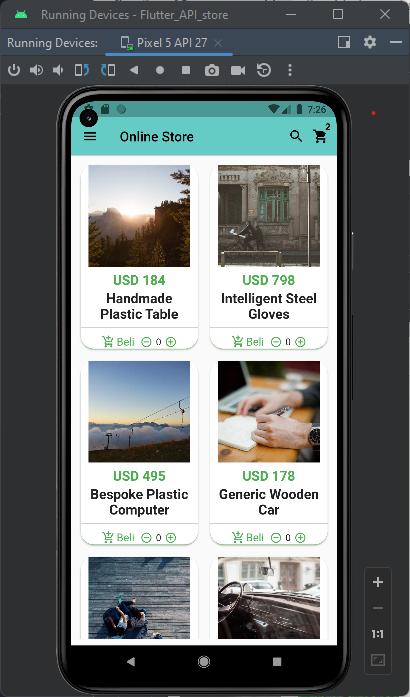
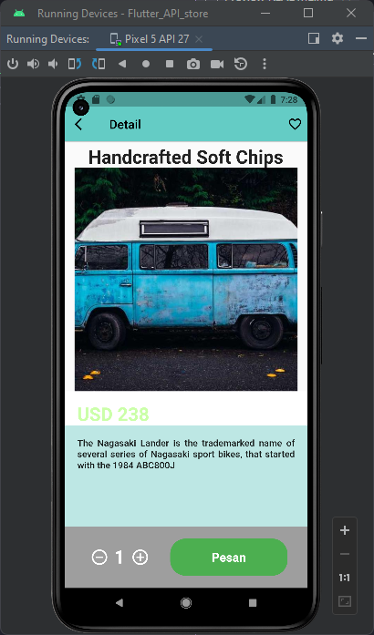

# Flutter_API_store


```bash
$ git clone https://github.com/noval1802/Flutter_API_store.git

$ cd flutter_API_store\flutter_Aplication_API_store

$ flutter upgrade 

$ flutter pub get

$ flutter run 
```

## Run the app in debug mode android.


### Detail product
